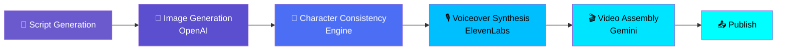
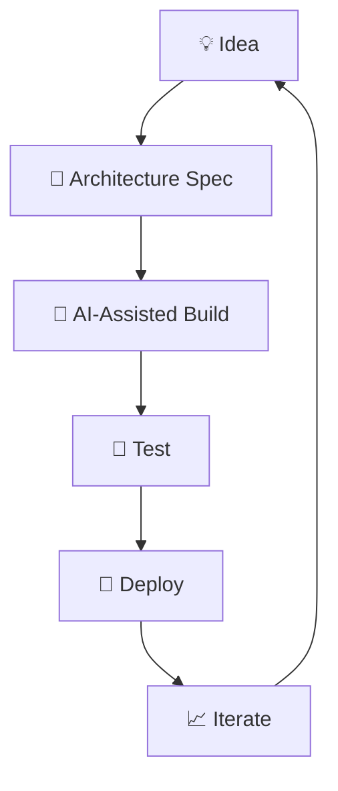

<!-- ========================================================= -->
<!--                  ANIMATED HEADER                          -->
<!-- ========================================================= -->

<p align="center">
  
</p>

<p align="center">
  
</p>

<p align="center">
  
  
  
</p>

<p align="center">
  <a href="https://github.com/YOUR_USERNAME"></a>
  <a href="https://linkedin.com/in/YOUR_LINKEDIN_USERNAME"></a>
  <a href="mailto:YOUR_EMAIL"></a>
  <a href="https://YOUR_PORTFOLIO"></a>
</p>

---

## 👋 About Me

```yaml
name: Muhammad Saad Akram
location: Lahore, Pakistan 🇵🇰
role: Full-Stack Developer & AI Systems Engineer

focus:
  - Autonomous AI agents & agentic tooling
  - Full-stack apps (Node.js / TypeScript / Next.js / MongoDB)
  - Browser automation (Playwright / Selenium)
  - Chrome extensions

stack:
  backend:  [Node.js, Express, TypeScript, MongoDB Atlas]
  frontend: [Next.js, React, Tailwind]
  infra:    [VPS, Vercel, Docker, Linux]
  ai:       [OpenAI, Google Gemini, ElevenLabs, Perplexity, Claude]

approach: >
  Write a detailed architecture spec first, then hand it off
  to an AI coding agent to build.
```

---

## 🚀 Now Building

**An automated anime YouTube pipeline** — script generation → AI image
generation → voiceover → video assembly, fully hands-off, with a character
consistency layer so the same character looks right across every scene.



Also actively shipping:

- 📧 **animezone.me** — a self-hosted disposable/temporary email platform
- 🏆 **UCP Live Leaderboard** — a Chrome extension with a dark cyberpunk UI
- 🧠 **Agent CLI tooling** — Claude-Code-style agents wired through browser automation

---

## 🧠 Exploring Right Now

Deep in evaluating **open-weight LLMs for coding workflows** — chasing the
best mix of speed and quality across:

`Qwen3` · `GPT-OSS-120B` · `MiniMax M2.7 / M3` · `Nemotron` · `DeepSeek V4` · `GLM-5.2` · `Kimi K2.7`

Benchmarking against **SWE-bench Pro** and **Terminal-Bench**, and testing free
inference options on **OpenCode Zen** and **DigitalOcean Model Studio**.

---

## 🛠️ Tech Stack

<p align="center">

</p>

### 🤖 AI, Agents & Automation

<p align="center">
  
  
  
  
  
  <br/>
  
  
  
  
</p>

---

## ⚙️ How I Build



---

## 📊 GitHub Stats

<p align="center">
  
  
</p>

<p align="center">
  
</p>

<p align="center">
  
</p>

<p align="center">
  
</p>

---

## 🚀 Featured Projects

| Project | What it does |
|---|---|
| 📧 **animezone.me** | Self-hosted temp-email platform — Node.js/TS/Express, MongoDB Atlas, Socket.IO live inbox updates, JWT + admin 2FA, Next.js frontend, multi-domain DNS/MX routing |
| 🎬 **Anime AI Studio** *(in progress)* | End-to-end automated anime video pipeline — script → OpenAI image gen → ElevenLabs voice → Gemini video assembly, with cross-scene character consistency |
| 🏆 **UCP Live Leaderboard** | Chrome extension with a dark cyberpunk/gaming-themed real-time leaderboard UI |
| 🧠 **Agent Tooling** | Claude-Code-style CLI agent routed through Playwright browser automation, plus ongoing LLM benchmarking for coding workflows |

<details>
<summary>🧪 Also tinkered with</summary>
<br/>

- Monero (XMRig) mining proxy server — Node.js + Stratum protocol
- DeepSeek chat scraper exposing an OpenAI-compatible REST API for Codex CLI / Continue.dev
- `claudo` — Claude Code proxied through DigitalOcean Gradient AI via LiteLLM
- Selenium-based Microsoft account login automation with Gmail API verification retrieval

</details>

---

## 🎓 Background

Computer Science (FOIT) @ University of Central Punjab — alongside coursework
in calculus and C++. Started with HTML/CSS/JS fundamentals, moved through
React (with Vite and React Router), and now builds full agentic systems on
top of that foundation.

---

## 🎌 Beyond the Code

Anime, cosplay photography, and Marvel/comic-book aesthetics — no surprise
the current side project is an anime content pipeline. 🎨

---

## 🎯 2026 Goals

- 🎬 Ship the anime AI pipeline end-to-end
- 🚀 Take a SaaS product from idea to production
- 🤖 Build more autonomous, tool-using agents
- 🌐 Contribute to open source
- 🏆 1000+ GitHub contributions

---

## 🐍 Contribution Snake

<p align="center">
  
</p>

---

## 🌐 Let's Connect

<p align="center">
  <a href="https://github.com/YOUR_USERNAME"></a>
  <a href="https://linkedin.com/in/YOUR_LINKEDIN_USERNAME"></a>
  <a href="mailto:YOUR_EMAIL"></a>
  <a href="https://YOUR_PORTFOLIO"></a>
</p>

<p align="center">⭐ Thanks for stopping by ⭐</p>

<p align="center">
  
</p>
